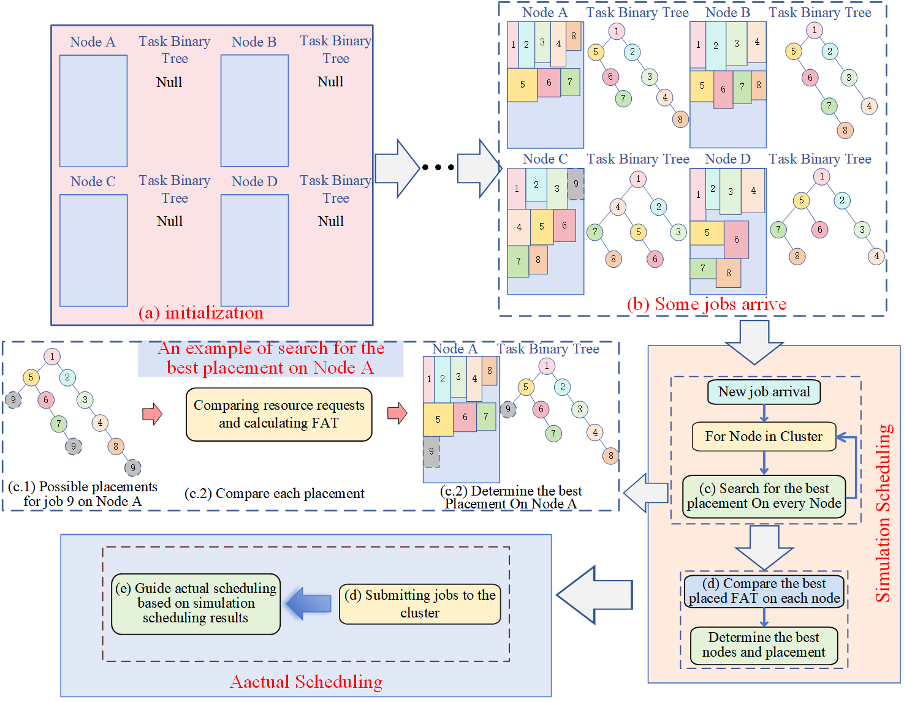

# JFAT: A Heuristic Scheduling Algorithm for Deep
 
FAT is a scheduling algorithm guided by the FAT scheduling metric. It significantly improves GPU utilization and effectively reduces job completion time by comprehensively considering GPU heterogeneity, cluster load balancing, and job deadline (DDL) requirements.

This repository contains the scheduler implementation and a heterogeneous GPU cluster simulator. The Kubernetes ported version is in another developing [repository](https://github.com/MLSched/UNS).

## Highlights
- **Optimizing GPU Utilization and JCT:** By considering GPU fragmentation and heterogeneity, we enhance fine-grained GPU utilization, reduce JCT, better utilize GPU resources, and improve service quality.
- **Novel Scheduling Algorithm:** We propose a heuristic scheduling algorithm to find the optimal GPU and placement for deep learning jobs, leveraging heterogeneous GPU characteristics to optimize JCT and GPU utilization.
- **DDL Mode:** To meet strict job DDL requirements, we introduce a DDL mode that users can enable to meet job deadlines, increasing scheduler flexibility.

## Contents
```
.
├── cases: test cases.
├── data: output metrics data.
├── datasets: Datasets and load ratio function.
├── metrics: code for metrics.
├── schedulers: schedulers implementations.
├── simulator: heterogenous GPU cluster simulator.
├── config.json: configuration file.
├── main.go: Core logic of the simulator..
└── util: helper codes.

```
## Requirements
Linux OS (e.g., CentOS, RedHat, Ubuntu).

Python == 3.9

Go == 1.17.9

## The Architecture of JFAT


## How to Process Raw data
```
cd datasets
python3 pod_norm_all.py
```
## How to run
```
cd ..
go run main.go
```
## How to Process Scheduling Reports
```
cp report.json ./data/normal_nums
or 
cp report.json ./data/rate
python3 extract.py
python3 makespan.py
python3 timeCost.py
```